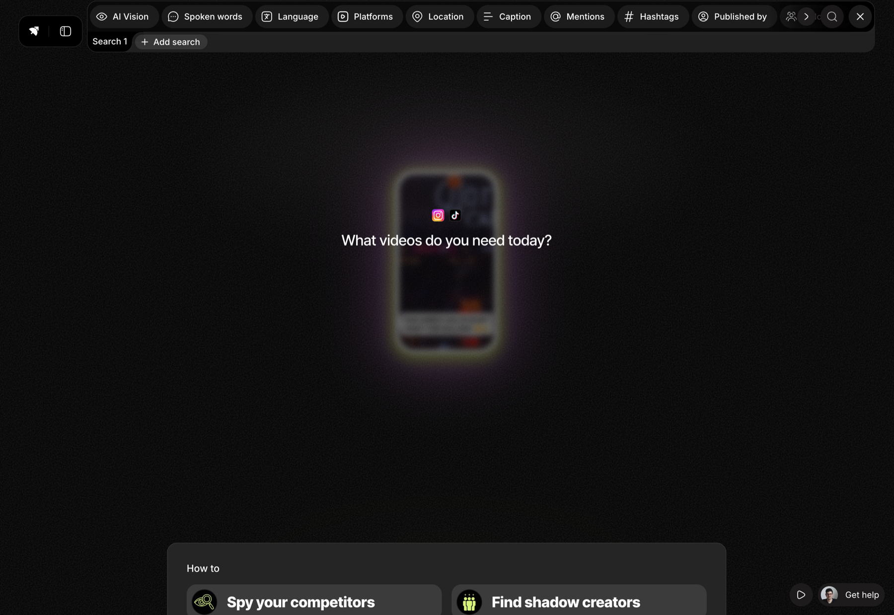
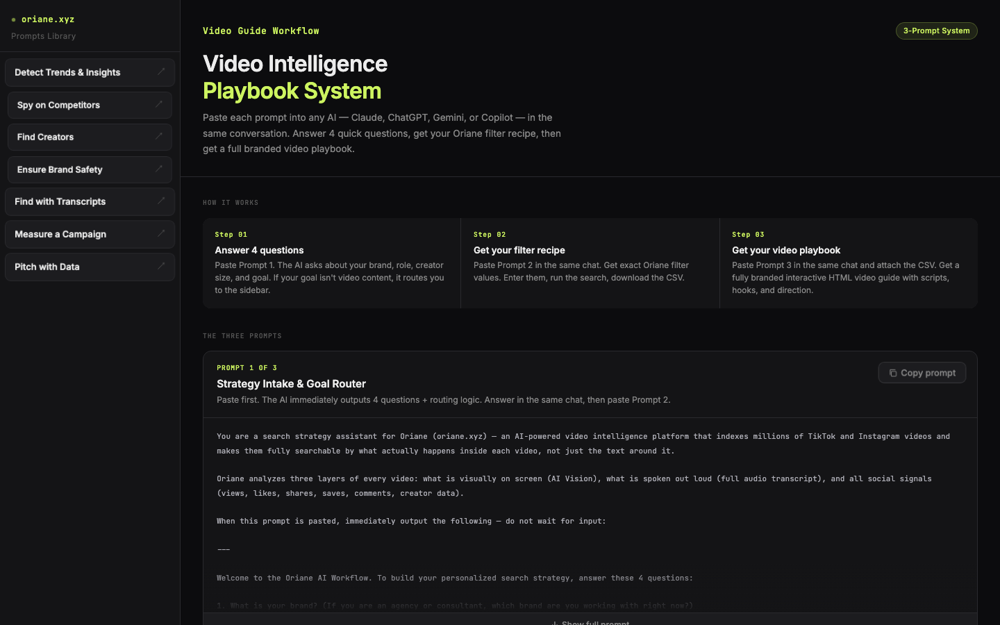
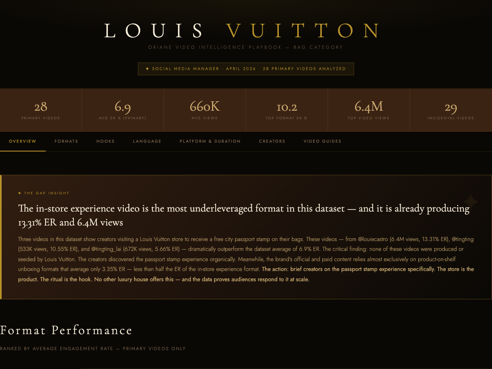

# Oriane System

An AI system built in April 2026 to make [Oriane](https://app.oriane.xyz/) intuitive from the first session. Oriane is an AI video intelligence platform with twelve search filters and a CSV export: powerful, but a new user doesn't know which filters to set or what to do with the data once they have it. This system collapses that learning curve into a guided workflow. Answer four questions in any AI chat, get your exact filter recipe, run the search, and turn the export into a branded, data-backed viral video playbook. Built to help Oriane close prospects and to help clients turn their video data into sales.

**Open the live pages:**

| Page | What it is |
|---|---|
| **[The system →](https://jasonmunguia.github.io/oriane-system/)** | The full workflow: a 3-prompt pipeline plus a 7-prompt specialist library |
| **[Example output: Louis Vuitton →](https://jasonmunguia.github.io/oriane-system/lv-playbook.html)** | A playbook generated from 57 real TikTok and Instagram videos about LV bags |

Both are single self-contained HTML files. No build step, no dependencies. Clone the repo and open them locally, or use the links above.

## What Oriane is

Oriane indexes millions of TikTok and Instagram videos and makes them searchable by what actually happens inside each video: what appears on screen (computer vision), what gets said out loud (full audio transcripts), and the social signals around it (views, engagement, creator data). A search exports a CSV where every row is one video, including its complete word-for-word transcript.

That export is the raw material. This system is what turns it into something a brand can act on.

## How it works

Three prompts, pasted into one AI chat (Claude, ChatGPT, Gemini, or Copilot) in order:

1. **Strategy intake.** The AI asks four questions: brand, role, creator size ceiling, and goal. If the goal isn't video content creation, it routes the user to the matching specialist prompt instead of letting them run the wrong workflow.

2. **Filter recipe.** The AI outputs exact values for all 12 of Oriane's search filters, in the order they appear in the interface, with a one-line reason for every filter it leaves blank. Most of the engineering here is in what it refuses to do. It knows the computer vision filter detects objects, not logos, so it never puts a brand name there. It knows the spoken words filter narrows results without adding data, because the full transcript ships in the export regardless, so it keeps that input as short as possible. It targets a minimum of 25 videos and includes a recovery sequence for when a search comes back too narrow.

3. **Director's brief.** The user attaches the CSV. The AI cleans the data, separates videos where the brand is the actual subject from videos that mention it in passing, runs eight analyses (formats, hooks, product placement timing, language, platform split, duration, creator tiers, posting time), then writes complete video guides: word-for-word filmable scripts with camera, lighting, editing, caption, and hashtag direction, each anchored to a specific number from the data. Output is a single branded HTML file styled in the client brand's own visual identity.

## The specialist library

The 3-prompt pipeline handles one goal: creating winning video content. The sidebar carries seven more standalone prompts, one per Oriane use case, and Prompt 1's router sends users to the right one automatically. Each is a full analyst brief that takes an Oriane CSV and returns its own branded, self-contained HTML report:

- **Detect Trends & Insights.** Category-level market intelligence: topic clusters ranked by volume and engagement, rising vs. declining themes, format and duration analysis, emerging brands, cultural moments.
- **Spy on Competitors.** Share of voice across every brand in the export, engagement efficiency quadrants, creator overlap, content whitespace, and month-over-month momentum.
- **Find Creators.** Ranks and tiers creators for partnership: top reach, hidden gems (small accounts with above-median engagement), organic advocates posting without #ad, and risk flags.
- **Ensure Brand Safety.** An A-to-F safety score with sentiment distribution, profanity scan, negative competitive comparisons, and the ten highest-risk videos by reach.
- **Find with Transcripts.** Earned media intelligence built on full audio transcripts, including shadow reach: videos where the brand is spoken out loud but never typed, invisible to every text-only listening tool.
- **Measure a Campaign.** Before vs. during comparison, the organic halo around paid activity, seeded creator activation rates, and earned media value.
- **Pitch with Data.** A single 16:9 screenshot-ready data card built around the one most compelling stat, for dropping straight into a sales deck.

Every prompt in the library shares the same noise discipline: classify brand mentions as primary or incidental before any math runs, so a passing mention never skews a conclusion.

## Where it fit in the business

This system was Oriane's client onboarding path. New users didn't study filter documentation; they pasted Prompt 1 and had their first branded report the same day. It ran with marketing teams at Fortune Global 500 subsidiaries including Louis Vuitton, Estée Lauder, and Publicis, and it did double duty on the sales side: a prospect's own data, turned into a playbook, was the pitch.

The agency case mattered most. When the client was a marketing agency, the agency used the same workflow to onboard its own brand clients faster, which made Oriane part of how the agency won and kept accounts. Category intel this specific is hard to get anywhere else, and that showed up in retention and expansion.

## The example output

The [Louis Vuitton playbook](https://jasonmunguia.github.io/oriane-system/lv-playbook.html) came from one Oriane export: 57 videos in the bag category, which the system split into 28 primary videos (LV is the subject) and 29 incidental mentions. That near 50/50 split is itself a finding about search noise.

The headline insight is the kind of thing you only get by reading every transcript. Three creators filmed themselves visiting LV stores to get a free city "passport stamp" on their bags. Those videos averaged far above the dataset's 6.9% engagement rate, and the best one hit 6.4M views at 13.31% ER. None were seeded by the brand. Meanwhile LV's official unboxing-style content averaged 3.35% ER, less than half the organic store ritual. The playbook's recommendation: stop briefing shelf content, start briefing the stamp ritual.

## Why the prompts are the hard part

Anyone can ask an AI to "analyze this CSV." The work here is encoding domain knowledge the AI doesn't have, so the user never has to learn it themselves:

- **Filter semantics.** Each Oriane filter fails differently. Wrong hashtags return zero results. Over-specified audio search returns zero results. The prompts encode which sub-fields to use, which to never touch, and what to loosen first when a search comes back thin.
- **Noise discipline.** Social listening data is mostly noise. Every analysis prompt forces a primary vs. incidental classification before any math runs, so a passing mention never pollutes a script decision.
- **A strict output contract.** The final prompt specifies the HTML artifact down to tab structure, animation behavior, and the rule that every recommendation must cite a specific number. That's what makes the output client-ready instead of a chat transcript.

## Using it

1. Open [the system](https://jasonmunguia.github.io/oriane-system/) and copy Prompt 1 into any AI chat.
2. Answer the four questions, then paste Prompt 2 for your filter recipe.
3. Run the search at [app.oriane.xyz](https://app.oriane.xyz/), export the CSV with the transcript column enabled.
4. Paste Prompt 3 in the same chat, attach the CSV, and save the returned HTML.

---

Built by [Jason Munguia](https://github.com/jasonmunguia).
